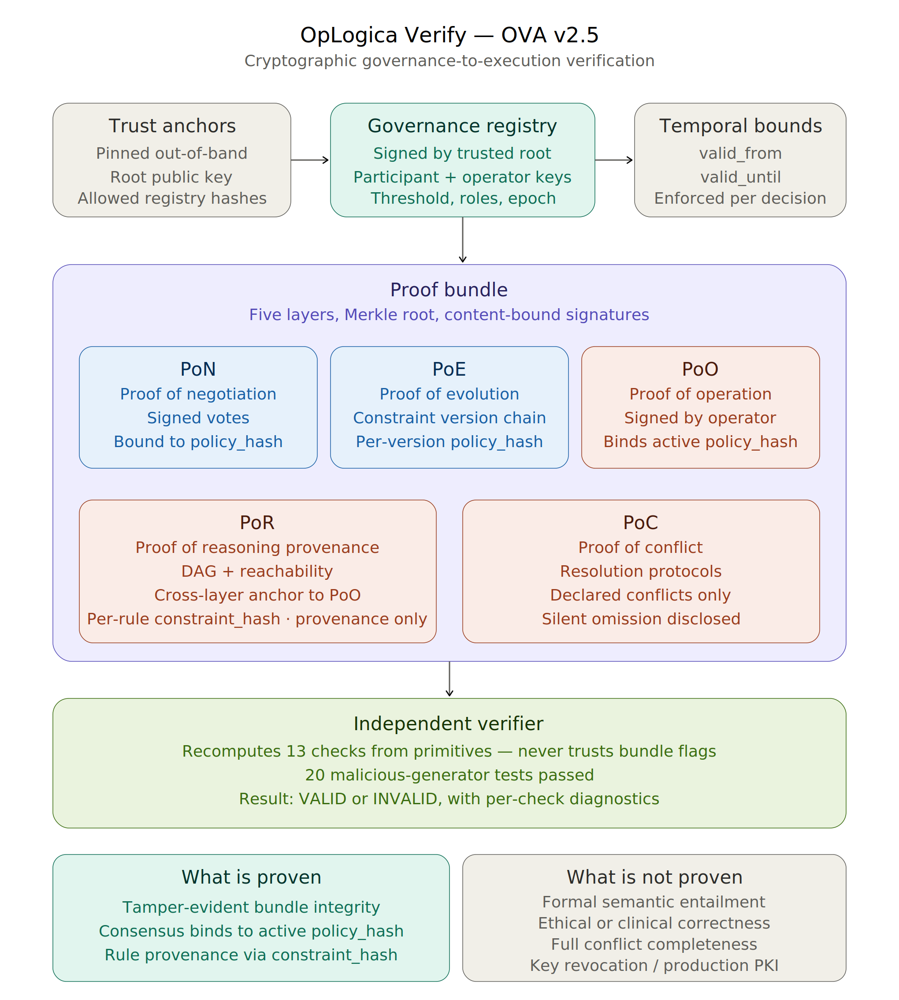

# OpLogica Verify

**Cryptographic governance-to-execution verification for AI decision systems.**

*Rule provenance and governance binding — not formal decision correctness.*

Current release: **OVA v2.5** — Proof of Concept

> This repository is a research-grade proof-of-concept, not a production compliance product.

---

## Executive summary

When an automated system makes a decision under a policy that humans negotiated, can a third party verify — independently and after the fact — that the executed policy was the one that was actually approved, that the rules invoked came from that policy, and that nothing was tampered with along the way?

OpLogica Verify (OVA) is a five-layer cryptographic proof bundle that answers that question with a verifier any auditor can run offline. It is deliberately scoped: it proves cryptographic governance-to-execution binding, not formal logical correctness of the decision, not its ethical soundness, and not perfect detection of omitted conflicts. Those limits are declared explicitly throughout the artifacts.

The architecture was hardened through six rounds of adversarial probing with GPT and Gemini, followed by independent review from DeepSeek and a final Gemini pass. These models were used as adversarial probes, not authorities: every accepted critique was converted into an executable test or an explicit scoped limitation before it counted.

---

## Quick start

```bash
# Requires Python 3.10+ and the cryptography library
pip install cryptography

# Run the end-to-end demo:
#   1. Generate a clean proof bundle for a medical triage scenario
#   2. Run the verifier (13 independent checks)
#   3. Run the tamper suite (6 tests)
#   4. Run the malicious-generator suite (20 tests)
python3 ova_v2.py
```

Expected output:

```
[2] Verifier result: VALID
    Checks passed (13/13)
[3] Tamper suite: 6/6 passed
[4] Malicious-generator suite: 20/20 passed
```

Generated artifacts:

- `ova_v2_bundle.json` — the clean proof bundle
- `ova_v2_tamper_suite.json` — per-test tamper results
- `ova_v2_malicious_generator_suite.json` — per-test malicious-generator results

---

## Architecture



The system has three structural zones:

**Trust anchors (pinned out-of-band).** The verifier hard-codes a trusted root public key and a set of allowed registry content hashes. These are the only inputs the verifier trusts without verification.

**Governance registry (signed by the trusted root).** Carries authorized participant identities and public keys, authorized operator identities and public keys, the consensus threshold, the critical-acceptor roles, the epoch identifier, and a temporal validity window (`valid_from` / `valid_until`).

**Proof bundle (five layers, Merkle-rooted).**

- **PoN** — *Proof of Negotiation.* Signed votes from participants, each bound to a specific `policy_hash`.
- **PoE** — *Proof of Evolution.* The constraint version chain, with per-version `policy_hash` and `previous_version_hash` links.
- **PoO** — *Proof of Operation.* The signed decision record, binding the active `policy_hash` to the decision timestamp.
- **PoR** — *Proof of Reasoning Provenance.* The reasoning graph (premises, rules, conclusions), with DFS-verified DAG structure, reachability from conclusions back to premises, per-rule `constraint_hash`, and a cross-layer anchor to PoO.
- **PoC** — *Proof of Conflict.* Declared conflicts with resolution protocols. **Records integrity only — silent omission is disclosed as a known limitation.**

The verifier consumes a bundle plus a registry and returns `VALID` or `INVALID` with per-check diagnostics. It recomputes every integrity claim from primitive records and never trusts `*_verified` flags written by the generator.

---

## What OVA v2.5 proves

1. **Tamper-evident bundle integrity.** Any modification to any field changes the Merkle root.
2. **Registry authenticity.** Only registries signed by the pinned trusted root and whose content hashes are in the pinned allow-list are accepted.
3. **Temporal validity.** The decision timestamp must fall within the registry's `valid_from` / `valid_until` window.
4. **Vote authentication.** Each vote is cryptographically signed by its participant; the verifier resolves the public key from the registry, not from the bundle.
5. **Quorum integrity.** The consensus threshold and critical-acceptor rule are enforced from the registry, not from values written by the generator.
6. **Operator-key anchoring.** The operator's public key is resolved from `registry.authorized_operators`, not from any field inside PoO.
7. **Policy-content binding.** Vote signatures and PoO bind to `policy_hash` (the content hash of the constraint set), not just to symbolic version names.
8. **Active policy binding.** Every ACCEPT vote counted toward quorum must match the executed policy on three dimensions: `epoch_id`, `policy_version_id`, and `policy_hash`.
9. **Cross-layer binding.** PoR carries a `poo_anchor` that must match the bundle's PoO. A reason graph from one bundle cannot be grafted onto another bundle's PoO.
10. **Rule provenance.** Every rule in PoR carries `policy_hash` + `constraint_hash`. The verifier recomputes both from the active policy and rejects rules whose constraint does not exist or whose hash does not match.
11. **DAG + reachability.** The reasoning graph is cycle-free and every conclusion has a derivation path reaching at least one premise.
12. **Verifier independence.** All `*_verified`, `quorum_satisfied`, and `graph_is_dag` flags written by the generator are ignored; the verifier recomputes from primitives.

---

## What OVA v2.5 does NOT prove

OVA v2.5 makes no claim about any of the following. These are explicit non-claims, documented in `verification_scope` inside every bundle.

1. **Formal semantic entailment.** OVA proves that PoR uses authorized policy rules. It does **not** prove that the conclusions formally follow from the premises under those rules.

    *Concrete example.* A rule `IF vital_score < 0.4 THEN priority = HIGH` with premise `vital_score = 0.38` but recorded conclusion `priority = MEDIUM` would NOT be detected by OVA v2.5 as a semantic inconsistency, because the verifier confirms rule provenance (the rule is authorized and bound to the active policy) but does not evaluate whether the conclusion logically follows from applying the rule to the premise.

    Closing this gap requires a constraint DSL plus a SAT/SMT solver and is listed under [Future work](#future-work).

2. **Ethical or clinical correctness.** OVA records that constraints were negotiated by an identified quorum and that decisions invoked authorized rules. Whether the constraints are ethically defensible, or whether a triage decision was clinically appropriate, is outside the framework.

3. **Full conflict completeness.** PoC verifies the *integrity* of recorded conflicts (none silenced, protocols valid). It does **not** prove that all conflicts that should have been recorded actually were. A malicious or buggy decision engine could omit a conflict entirely from PoC and the verifier would not detect the omission.

4. **Key revocation within an active epoch.** If a participant, operator, or registry root key is leaked mid-epoch, the attacker can produce valid-looking bundles until the next registry rotation. Mitigations are out-of-band (rotate the registry, externally annotate affected bundles).

5. **Post-quantum security.** The prototype uses Ed25519, tagged as `Ed25519-prototype-2026`. Production target is ML-DSA / Dilithium-III (FIPS 204).

6. **RFC 6962 Merkle compliance.** The Merkle tree uses simple binary construction with last-node duplication, not RFC 6962. Interoperability with transparency log infrastructure is future work.

---

## Verifier checks

Each check is independent and recomputed from primitives. A bundle is `VALID` only if all 13 pass.

| # | Check | What it verifies |
|---|---|---|
| 1 | `registry_signature_valid` | Registry is signed by the trusted root and its hash is in the pinned allow-list |
| 2 | `registry_temporal_validity` | `valid_from ≤ decision_timestamp ≤ valid_until` |
| 3 | `pon_quorum_integrity` | Recomputed quorum from registry threshold + roles + weights satisfies the axiom |
| 4 | `pon_vote_signatures_valid` | Every vote signature verifies against the registry-anchored participant key |
| 5 | `poe_chain_monotonicity` | Each constraint version's `self_hash` and `previous_version_hash` chain are valid |
| 6 | `policy_hash_consistency` | Vote and PoO `policy_hash` references exist in PoE; per-version `policy_hash` recomputes from raw constraints |
| 7 | `policy_consensus_execution_binding` | ACCEPT votes counted toward quorum match PoO on `epoch_id` + `policy_version_id` + `policy_hash` |
| 8 | `poo_signature_valid` | PoO signature verifies against the operator key resolved from the registry |
| 9 | `por_signature_binding_valid` | PoR's `poo_anchor` matches the bundle's PoO exactly |
| 10 | `por_rule_policy_binding` | Each rule's `from_constraint` exists in the active policy; `constraint_hash` matches recomputation |
| 11 | `por_structural_consistency` | All references resolve; DFS cycle detection passes; reachability to premises holds |
| 12 | `poc_record_integrity` | No conflict is `silenced`; all `resolution_protocol` values are in the valid set |
| 13 | `merkle_root_match` | Recomputed Merkle root from the five layer hashes matches the stored root |

---

## Adversarial hardening journey: v2.0 → v2.5

OVA v2 was rebuilt from a rejected paper (v1) submitted to *AI and Ethics* in December 2025. Each version below was triggered by a specific blocking issue raised in adversarial review. The pattern was: review → blocking issue → fix → new malicious test → next review. **No diagram, no public exposure, no LinkedIn post was produced until v2.5 cleared two independent reviews with zero blocking issues.**

> **Methodological note.** GPT, Gemini, and DeepSeek were used as adversarial probes, not authorities. A critique counted only when it became an executable test or an explicit scoped limitation. The "blocking issue identified by" column below records which probe surfaced each issue, not which probe decided the architecture was acceptable — that determination is made by the verifier, the test suites, and the explicit scope declarations in `verification_scope`.

| Version | Blocking issue identified by | Architectural response |
|---|---|---|
| v2.0 | *Reviewer 1 (journal)* — PoI from v1 framework was a "developed thought experiment" rather than a deployable mechanism | Decompose PoI into three concrete proofs: **PoN** (negotiation), **PoC** (conflict), **PoE** (evolution) |
| v2.1 | *GPT* — the verifier was reading `*_verified` flags written by the generator instead of recomputing from primitives | **Verifier independence**: recompute every integrity claim from primitive records; treat stored flags as metadata only |
| v2.2 | *Gemini* — the bundle was self-authoring its own constitutional rules (threshold, roles, weights); the verifier had no actual DAG check, only a trusted flag | **Anchored governance registry** signed by a pinned trusted root; participant and operator public keys live in the registry, not in the bundle. **DFS-based cycle detection** for PoR |
| v2.3 | *Gemini* — participant signatures bound only to symbolic policy IDs (e.g., `"CV_1"`), not to the actual constraint content. Separately, PoR signatures had no cross-layer binding to PoO | **Content-bound signatures**: every vote and every PoO commitment binds to `policy_hash = hash(constraints)`. **Cross-layer binding**: PoR carries a `poo_anchor` matched against the bundle's PoO |
| v2.4 | *Gemini* — even with content-bound signatures, votes approving CV_1 could be used to claim consensus for executing CV_2 if both versions were in PoE | **Active policy binding**: every ACCEPT vote counted toward quorum must match the executed policy on `epoch_id` + `policy_version_id` + `policy_hash` |
| v2.5 | *Gemini* — PoR proved a rule existed in the policy, but did not prove that the *content* of the rule invocation matched the constraint it claimed to invoke | **Rule-policy binding**: each `rule_applied` carries `policy_hash` + `constraint_hash`; the verifier recomputes per-constraint hashes from the active policy and rejects arbitrary rule injection |
| v2.5 final | *DeepSeek + Gemini (7th pass)* — independent academic reviews | **Zero blocking issues found.** Three documentation additions: concrete entailment-gap example, performance benchmarking added to future work, TLA+/Coq formal verification of the verifier added to future work |

A separate document, [`oplogica_v2_foundation.md`](oplogica_v2_foundation.md), maps each layer of v2 onto the specific objection in Reviewer 1's report from the v1 journal submission, with explicit "remaining risk" entries for each layer.

---

## Test results

The repository includes two independent test suites that run automatically when `ova_v2.py` is executed. Both achieve 100% pass rate against the v2.5 verifier.

### Tamper suite — 6 / 6 passed

Each test mutates one field of a deep-copied valid bundle and confirms the verifier returns `INVALID` with the expected failed check. Defense in depth: every layer tamper also trips `merkle_root_match`, but the layer-specific check fails first.

| Test | Mutation | Expected fail |
|---|---|---|
| T1 | Flip both critical-acceptor votes to REJECT | `pon_quorum_integrity` |
| T2 | Break a `previous_version_hash` link in PoE | `poe_chain_monotonicity` |
| T3 | Change `input_data_hash` in PoO | `poo_signature_valid` + `merkle_root_match` |
| T4 | Add an invalid reference in a PoR conclusion | `por_structural_consistency` |
| T5 | Mark a conflict as `silenced` in PoC | `poc_record_integrity` |
| T6 | Replace the Merkle root with garbage | `merkle_root_match` |

### Malicious-generator suite — 20 / 20 passed

This is the harder test class. Each test simulates a *malicious generator* who controls all cryptographic keys, recomputes all hashes consistently, and writes false metadata flags. The verifier must catch the fraud by recomputing from primitive records — never trusting the generator's metadata.

The 20 tests cover five attack classes:

**Flag-lying (MG_A–D).** Writing false `*_verified` flags while keeping internal hash consistency.
**Governance parameter manipulation (MG_E–H).** Injecting fake thresholds, puppet participants, inflated vote weights, or escalated roles.
**DAG cycle injection (MG_I).** Building a circular reason graph while claiming `graph_is_dag = true`.
**PKI / trust anchoring (MG_J–N).** Registry substitution, vote forgery, operator-key substitution, registry version skew, unsigned registry.
**Semantic binding (MG_O–T).** Floating logic islands, policy payload substitution, cross-layer graph grafting, cross-version vote grafting, cross-epoch vote replay, arbitrary rule injection.

For each test, the expected failed check is declared up-front, and the actual failed check matches with surgical precision — for example, MG_K (vote forgery) fails *only* on `pon_vote_signatures_valid`, not on the Merkle root, demonstrating that the protection comes from the semantic binding and not from the surrounding structural integrity.

Full per-test results are in [`ova_v2_malicious_generator_suite.json`](ova_v2_malicious_generator_suite.json).

---

## Known limitations

These are limitations of the current proof of concept, not bugs. Each is declared in `verification_scope` inside every bundle.

- **Single scenario.** The proof of concept demonstrates one medical triage decision with four constraints, one timing conflict, two policy versions, and one decision. It is not a statistical evaluation. The scenario was chosen to mirror Reviewer 1's exact concerns from the v1 rejection.
- **PoR signer = PoO operator.** In this prototype, the same operator signs both PoO and PoR. Production deployment would separate these identities to support multi-party reasoning attribution.
- **No formal semantic entailment.** See [What OVA v2.5 does NOT prove](#what-ova-v25-does-not-prove), item 1.
- **Silent omission in PoC.** See [What OVA v2.5 does NOT prove](#what-ova-v25-does-not-prove), item 3.
- **Key revocation gap within an epoch.** See [What OVA v2.5 does NOT prove](#what-ova-v25-does-not-prove), item 4.
- **Ed25519 not post-quantum.** See [What OVA v2.5 does NOT prove](#what-ova-v25-does-not-prove), item 5.
- **Merkle tree not RFC 6962 compliant.** See [What OVA v2.5 does NOT prove](#what-ova-v25-does-not-prove), item 6.
- **Trust anchors generated at module load.** For the prototype, the trusted root key and signed registry are generated on import. Production deployment would pin the root key out-of-band (regulatory publication, transparency log) and load a signed registry from a known location.

---

## Related work

Recent 2026 work has begun converging on cryptographic governance for autonomous AI systems. The closest adjacent effort is:

**Aegis — Cryptographic Runtime Governance for Autonomous AI Systems** (Mazzocchetti, arXiv:2603.16938, March 2026). Proposes a runtime enforcement architecture in which autonomous agents are bound to a cryptographically sealed Immutable Ethics Policy Layer at genesis, with an Ethics Verification Agent, Enforcement Kernel Module, and Immutable Logging Kernel enforcing policy constraints during execution. Reports median proof verification latency of 238 ms and publication overhead of 9.4 ms in simulation.

OVA v2.5 differs in scope and method:

- **Scope.** Aegis prevents policy violations at runtime through autonomous enforcement and shutdown. OVA verifies, after the fact and offline, that an executed decision was bound to the approved policy, that invoked rules trace back to that policy via `constraint_hash`, and that the resulting proof bundle remained tamper-evident.
- **Method.** Aegis is simulation-based and evaluated through latency benchmarks. OVA is implementation-based and evaluated through 6 tamper tests and 20 malicious-generator tests, each of which targets a specific verifier check with surgical precision.
- **Distribution.** OVA is released as open-source Python under Apache 2.0 with a working verifier, executable test suites, and reproducible proof bundles. No public Aegis implementation appears to be available at the time of this writing.

In one line:

- **Aegis:** runtime enforcement of policy compliance.
- **OVA v2.5:** post-hoc cryptographic governance-to-execution verification.

Other relevant 2026 work includes runtime path-based governance (Kaptein et al., arXiv:2603.16586), capability-context separation for AI agent tool use (Zhou, arXiv:2603.14332), and zero-knowledge approaches to verifiable AI inference (e.g., Chainlink's ZKML, EigenAI arXiv:2602.00182). The field is converging on the general idea that AI accountability requires cryptographic, not contractual, enforcement; OVA's specific contribution is a fully reproducible verifier and adversarial-hardening methodology for post-hoc governance-to-execution binding.

---

## Future work

Listed in priority order, top to bottom.

1. **Constraint DSL + formal semantic execution verification.** Define a domain-specific language for constraints and integrate a SAT/SMT verifier (Z3, CVC5) so the bundle can carry a formal entailment proof in addition to rule provenance. Converts the rule-policy binding of v2.5 into full semantic correctness.
2. **Formal verification of verifier logic using TLA+ or Coq.** Beyond empirical adversarial testing, a mathematical proof that the verifier algorithm itself is free of logical gaps. Complements the previous item: SAT/SMT covers *content* correctness, TLA+/Coq covers *algorithm* correctness.
3. **Performance benchmarking on large bundles.** Empirical measurement of verifier latency and memory consumption under scaled constraint sets, especially in resource-constrained or distributed environments.
4. **Key revocation mechanism.** Signed CRL, OCSP-style anchor, or transparency-log-based revocation events consulted by the verifier alongside the registry.
5. **Independent conflict detector.** Apply the active constraint set to the decision state to produce an expected conflict set and compare against PoC's recorded conflicts. Closes the silent-omission gap.
6. **Post-quantum cryptography.** Upgrade Ed25519 to ML-DSA / Dilithium-III per FIPS 204.
7. **RFC 6962 Merkle tree.** Adopt the Certificate Transparency Merkle construction for interoperability with existing transparency log infrastructure.
8. **Separate PoR signing identity from PoO operator identity.** Support multi-party reasoning attribution.
9. **Formal trust model for PoN participants.** Reason about representativeness, legitimacy of quorum, and capture resistance.

---

## Repository layout

```
oplogica-verify/
├── README.md                                # this file
├── ova_v2.py                                # generator + verifier + test suites
├── ova_v2_bundle.json                       # example clean proof bundle
├── ova_v2_governance_registry.json          # trust anchor and signed registry
├── ova_v2_tamper_suite.json                 # tamper test results
├── ova_v2_malicious_generator_suite.json    # malicious-generator test results
├── oplogica_v2_foundation.md                # response to Reviewer 1
├── triage_scenario.md                       # scenario specification
├── oplogica_verify_v2_5_diagram.svg         # architecture diagram (vector)
└── oplogica_verify_v2_5_diagram.png         # architecture diagram (raster)
```

---

## Citation

If you reference OVA v2.5 in academic work, please cite as:

```
Ibrahim, M. (2026). OpLogica Verify (OVA v2.5): Cryptographic
governance-to-execution verification for AI decision systems.
Oplogica Inc. https://github.com/oplogica/oplogica-verify
```

A formal paper is in preparation. Watch this repository for updates.

---

## Status

**Current release:** OVA v2.5 — proof of concept

**Production readiness:** Research prototype. The artifacts in this repository demonstrate the architectural and cryptographic properties listed under [What OVA v2.5 proves](#what-ova-v25-proves). Production deployment would require the items listed under [Future work](#future-work), particularly key revocation, post-quantum signatures, and the constraint DSL + SAT/SMT integration.

**License:** Apache License 2.0 — see [`LICENSE`](LICENSE).

**Contact:** [oplogica-research@oplogica.com](mailto:oplogica-research@oplogica.com) — research questions, replication attempts, adversarial reviews welcome.

---

*OpLogica Verify — powered by OVA (Operational Verification Architecture).*
