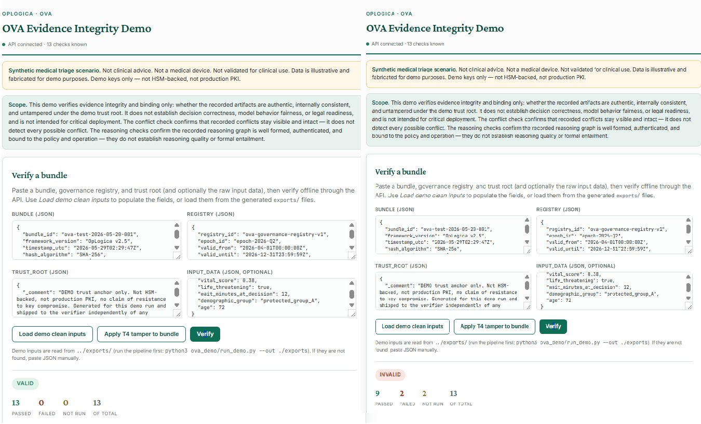

# OVA — Evidence Integrity Demo

**Live demo:** https://oplogica.com/ova-demo/



OVA (the OpLogica Verification Architecture) generates a cryptographically
verifiable **evidence bundle** for a governance-bound AI decision and lets
anyone **independently re-verify** it offline. This repository is a runnable,
deliberately honest **demo** of that verifier.

**What OVA verifies.** That a recorded evidence bundle has not been silently
altered after generation; that the executed operation binds to a specific
approved policy version and hash; that recorded reasoning and rules link to the
active policy constraints; that recorded conflicts remain visible and intact;
that signatures verify under a pinned demo trust root; and that the recomputed
Merkle root matches the stored one. The verifier **recomputes** these claims
from primitive records — it does not trust stored "valid" flags.

**What OVA does not verify.** It does not establish that a decision was correct,
that any model behaves fairly, that an institution meets a legal obligation, or
that this system is fit for real-world critical use. The conflict check confirms
that *recorded* conflicts stay intact — it does not detect every conflict that
should have been recorded. The reasoning checks confirm the recorded reasoning
graph is well formed, authenticated, and bound to the policy and operation —
they do not establish reasoning quality or formal entailment.

> **Synthetic medical triage scenario.** The demo scenario is fabricated and
> illustrative. Not clinical advice, not a medical device, not validated for
> clinical use. Demo keys only — not HSM-backed, not production PKI.

---

## Quickstart

### 1. Install dependencies

```bash
pip install -r requirements.txt
# for running the test suite as well:
pip install -r requirements-dev.txt
```

### 2. Run the full demo

```bash
python3 ova_demo/run_demo.py --out ./exports
```

This generates a clean bundle, registry, trust root, and input data; produces
all six tampered bundles; writes `exports/tamper_manifest.json`; and writes
`exports/evidence_integrity_report.md`. It prints a summary with the reconciled
clean-bundle status, the six tamper cases, and reproduction commands.

### 3. Open the local dashboard

The dashboard is served same-origin by the API (no CORS, one command):

```bash
uvicorn api.server:app --host 127.0.0.1 --port 8000
# then open http://127.0.0.1:8000/ui/
```

Click **Load demo clean inputs**, then **Verify**. Click **Apply T4 tamper to
bundle**, then **Verify**, to see a tampered bundle detected.

### 4. Verify the clean bundle (CLI)

```bash
python3 ova_demo/verify_bundle.py exports/clean_bundle.json \
  --registry exports/registry.json \
  --trust-root exports/trust_root.json \
  --input-data exports/input_data.json
```

Expected: reconciled **VALID**, 13 passed / 0 failed / 0 not run, **exit 0**.

### 5. Verify the T4 tampered bundle (CLI)

```bash
python3 ova_demo/verify_bundle.py exports/tampered_T4_por.json \
  --registry exports/registry.json \
  --trust-root exports/trust_root.json \
  --input-data exports/input_data.json
```

Expected: reconciled **INVALID**, 9 passed / 2 failed / 2 not run, **exit 1**.
T4 adds a non-existent reference to a reasoning conclusion: two checks fail
(`por_structural_consistency`, `merkle_root_match`) and two more are reported as
**not run** (`por_signature_binding_valid`, `por_rule_policy_binding`) rather
than silently disappearing.

---

## Architecture overview

```
ova_engine/     The vendored verification engine (ova_v2.py), treated as a
                read-only authority. The demo never modifies it. __init__.py
                re-exports the verifier, scenario, registry, and trust anchors.

ova_demo/       The demo packaging layer:
                  checks.py            canonical 13-check list + reconcile()
                  generate_bundle.py   writes clean bundle/registry/trust_root/
                                       input_data to disk
                  verify_bundle.py     standalone OFFLINE verifier CLI
                  tamper_examples.py   real tampered bundles + tamper_manifest
                  check_explanations.py per-check auditor-readable explanations
                  report_generator.py  human-readable Evidence Integrity Report
                  run_demo.py          one-command pipeline orchestrator

api/            api/server.py — a thin FastAPI wrapper exposing GET /health and
                POST /verify over the SAME verify -> reconcile path the CLI
                uses. It also serves the local dashboard at /ui (static files
                only; the mount is a no-op if ui/ is absent).

ui/             A minimal static dashboard (index.html, app.js, style.css). No
                build system, no framework, no database, no authentication.

tests/          One test file per component. All run the real engine; no mocks.
```

The same `engine.verify_bundle(...) -> reconcile(...)` core is reachable four
ways: the offline CLI, the one-command pipeline, the HTTP API, and the local
dashboard.

### The reconciliation layer (why it exists)

The engine returns `checks_total` as a hardcoded `13`. On some failing inputs,
two reasoning-nested checks short-circuit and never emit, so the raw result can
name only 11 checks while still claiming a denominator of 13. `reconcile()`
closes this at the edge: it partitions the canonical 13 into **passed**,
**failed**, and **not_run** (each named, with reasons), and these always sum to
13. Every surface (CLI, report, API, dashboard) renders the reconciled result,
never the engine's raw count.

---

## Demo outputs

Running the pipeline writes two primary artifacts into `./exports`:

- **`tamper_manifest.json`** — machine-readable. For each of the six tamper
  cases: the mutation, the tampered bundle path, the reconciled status, the
  passed/failed/not_run counts, the failed and not-run checks with reasons, and
  per-check explanation snippets.
- **`evidence_integrity_report.md`** — human-readable. Title, synthetic-triage
  banner, scope statement, demo-key/trust-root note, clean-bundle summary with
  the meaning/not-meaning block, a tamper summary table, per-case detail
  sections, reproduction commands, and a limitations section.

Further documentation:

- `docs/ARCHITECTURE.md` — component and data-flow detail.
- `docs/THREAT_MODEL.md` — what the demo assumes an attacker can and cannot do.
- `docs/LIMITATIONS.md` — explicit non-claims and known constraints.

---

## Scope discipline

This project follows a strict "never overclaim" rule. Specifically, nothing in
this repository asserts:

- legal or regulatory compliance,
- clinical or medical correctness,
- model fairness or absence of bias,
- readiness for production or critical deployment.

The project avoids absolute-coverage phrasing such as a bare percentage. Counts
are reported concretely (for example, "13 passed" or "9 passed, 2 failed, 2 not
run"). Wherever a check fraction appears, it is accompanied by a fixed
meaning / not-meaning statement:

```
N/13 integrity checks passed.
Meaning: the evidence bundle is internally consistent and tamper-evident under
the demo trust root.
Not meaning: the AI decision is medically correct, unbiased, or legally
compliant.
```

The current implementation is a Python reference implementation. Go/Rust SDKs
do not exist. Signatures are Ed25519-prototype-2026 (not post-quantum); the
production target ML-DSA (Dilithium-III, FIPS 204) is declared but not
implemented. The Merkle tree is a simple binary tree and does not implement the
RFC 6962 (Certificate Transparency) construction.

---

## Testing

Run each suite directly (no pytest required; each file has its own runner):

```bash
python3 tests/test_reconcile.py
python3 tests/test_cli.py
python3 tests/test_check_explanations.py
python3 tests/test_tamper_examples.py
python3 tests/test_report_generator.py
python3 tests/test_run_demo.py
python3 tests/test_api.py
python3 tests/test_dashboard.py
```

Or run them all:

```bash
for t in tests/test_*.py; do echo "== $t =="; python3 "$t" || break; done
```

The suite currently comprises **55 tests across 8 files**, and **all included
tests currently pass**. (Counts are stated concretely; the project avoids
absolute-coverage percentage phrasing.)

---

## Files not to commit

The demo writes runtime artifacts into `./exports` on every run, including a
freshly generated **trust root containing demo keys**. These are reproducible
and should not be committed. `.gitignore` excludes:

- generated trust roots and other `exports/` artifacts,
- virtual environments (`.venv/`, `venv/`, …),
- Python caches (`__pycache__/`, `*.pyc`, `.pytest_cache/`, …).

If you want to ship a fixed, intentional example set, place curated copies under
`examples/` (which is tracked) rather than `exports/` (which is ignored).

---

## Public demo and /exports

The `/exports` files are intentionally public for demo reproducibility. They
contain synthetic demo artifacts and a throwaway, freshly generated demo trust
root. They are **NOT** production keys, **NOT** production PKI, and **NOT**
security credentials. Do not reuse this setup in production.

---

## License

The code in this repository is licensed under **Apache-2.0** (see `LICENSE`).

The Apache-2.0 license covers the code only. It does **not** grant rights to the
"OpLogica" or "OVA" names, logos, or other brand or trademark assets (see
`NOTICE`). Using the code does not imply affiliation with or endorsement by
OpLogica Inc.


## Oplogica v0.2 Scope

v0.2 is a narrow, additive extension of the v0.1 demo. It does not change the
verifier, the trust model, or any existing API field. It adds three disciplined
layers on top of the existing `verify -> reconcile` path.

**What v0.2 adds**

- **Negative Claims Firewall** (`ova_demo/negative_claims_firewall.py`). A
  deterministic guard that scans Oplogica's *own* generated output (API framing
  text, UI labels, reports) for overclaiming language and refuses to let it
  pass. It catches affirmative claims such as "proves compliance" or an
  unqualified "compliant", while allowing honest negated disclaimers such as
  "does not certify compliance". It never inspects or judges user-provided
  bundle content, and it uses no model — only a fixed term list and
  clause-local negation handling.
- **L3 Coherence Failure Taxonomy** (`ova_demo/l3_failure_taxonomy.py`). For
  each failed or not-run check, it assigns a fixed failure class (for example
  `ghost_evidence_reference`, `hash_mismatch`, `declared_check_not_run`) with a
  reviewer-facing explanation, an explicit "means" and "does not prove", and
  flags for whether it is deterministic and detectable from the bundle alone. It
  operates only on the structured check results already produced by
  reconciliation. It never interprets free text and never asserts that a
  decision is correct or flawed.
- **Deterministic Post-Hoc Verification Discipline**
  (`ova_demo/verification_discipline.py`). A fixed metadata block attached to
  each result, stating in machine-readable form that checks are recomputed from
  the signed bundle, that no model interpretation is used, and that the result
  does not verify decision correctness, certify compliance, establish fairness,
  or detect silent omissions.

**What it does not prove**

v0.2 does not establish that an AI decision is correct, fair, lawful, or
clinically valid. A failure means the recorded evidence cannot support
independent review of the affected item — not that the underlying decision is
sound or flawed.

**Why no LLM interpretation is used**

Every v0.2 check is deterministic: the same input always yields the same result,
recomputed from the signed bundle and structured fields. Introducing a model to
interpret free text would make the verification layer itself unverifiable, which
would defeat the purpose.

**Why this is not a compliance certificate**

The verification-discipline block sets `is_compliance_certificate: false` and
`certifies_compliance: false`. Oplogica supports independent review and
tamper-evidence; it does not issue compliance determinations.

**Why this is not a new standard**

`is_a_standard: false`. v0.2 is a reference implementation of disciplined
overclaim prevention and structured failure classification on top of existing
prior art (audit logging, claim-evidence verification, assertibility
boundaries). It does not claim to define a standard.

**Reproduce the tests**

This project does not use pytest; each test file has its own runner.

```bash
python3 tests/test_negative_claims_firewall.py
python3 tests/test_l3_failure_taxonomy.py
python3 tests/test_verification_discipline.py
python3 tests/test_api.py
# or run the whole suite:
for t in tests/test_*.py; do echo "== $t =="; python3 "$t" || break; done
```
